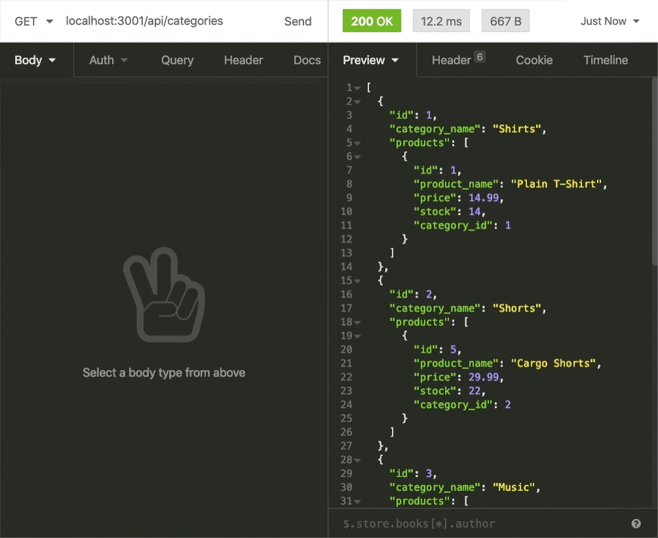
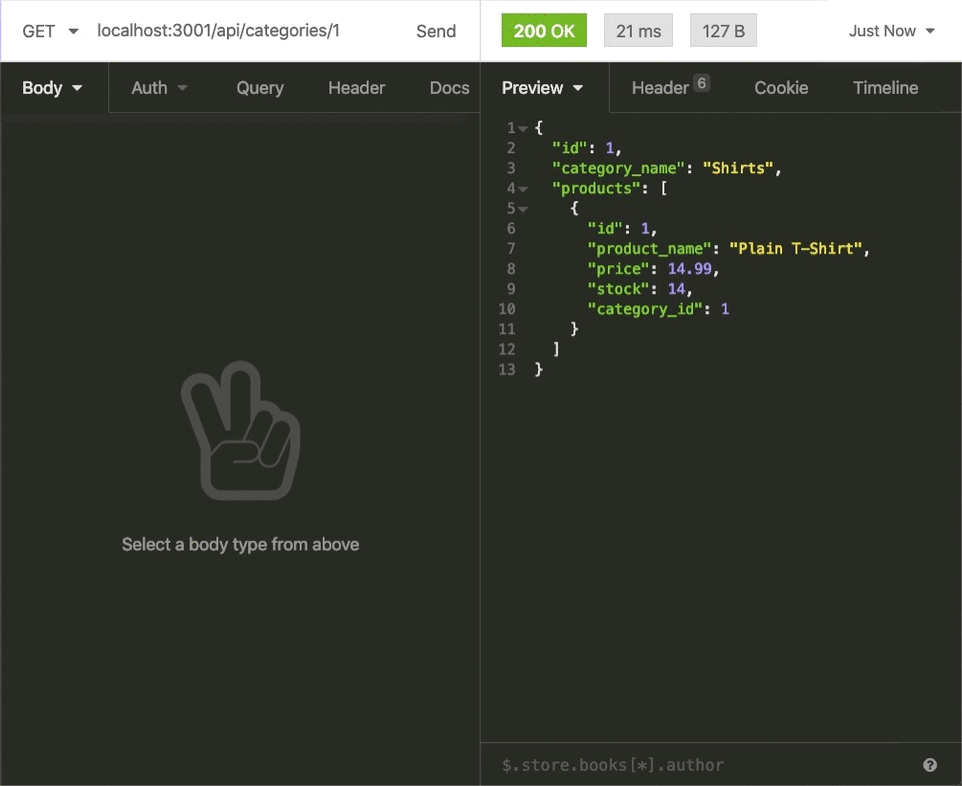
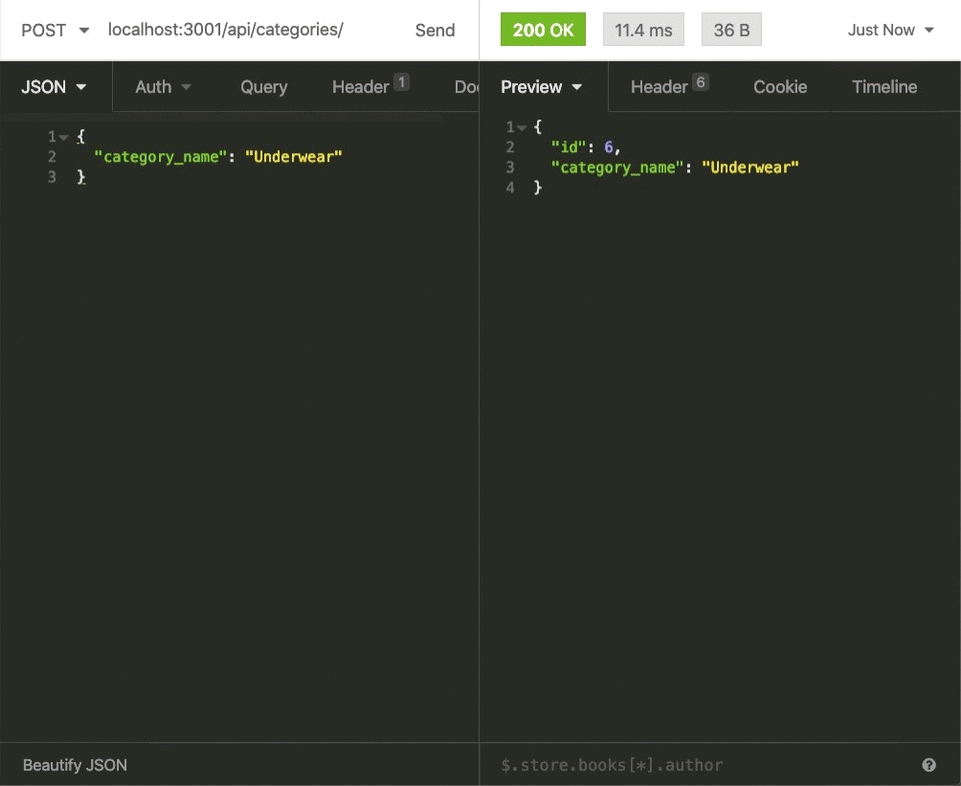

# E-Commerce Backend 
  ## License: None 
  ### 
  ## Table of Contents
  - [Description](#description)
  - [Installation](#installation)
  - [Usage](#usage)
  - [Testing](#testing)
  - [Additional Info](#additional-info)

  ## Description:
  This project is the creation of the back end for an e-commerce site. This application used Express.js API and Sequelize to interact with a MySQL database. This application displays creation of database using mySQL with models and associations. Then demonstrates the API Routes to perform RESTful CRUD operations displayed in my walk through videos.

  The following animations show examples of the application's API routes being tested in Insomnia.  
  The first animation shows GET routes to return all categories, all products, and all tags being tested in Insomnia:

  

  The second animation shows GET routes to return a single category, a single product, and a single tag being tested in Insomnia:

  

  The final animation shows the POST, PUT, and DELETE routes for categories being tested in Insomnia:

  

  ## Installation:
  The user should clone the repository from GitHub. This application requires Node.js, Express.js, and Sequelize. To connect to the database run mysql -u root -p and enter password from .env file. Then source the schema.sql. To seed the file run npm run seed. Finally to connect to the server run npm start.

  ## Usage:
  This application will allow users to view, add, edit, and delete categories, products, and tags.

  ## Testing:
  None.

  ## Additional Info:
  - Github: https://github.com/Havrushchenko
  - Email: glitteringpuzzle@gmail.com

  This README.md is made with a [Proffesional Readme Generator](https://github.com/Havrushchenko/proffesional-readme-generator).
